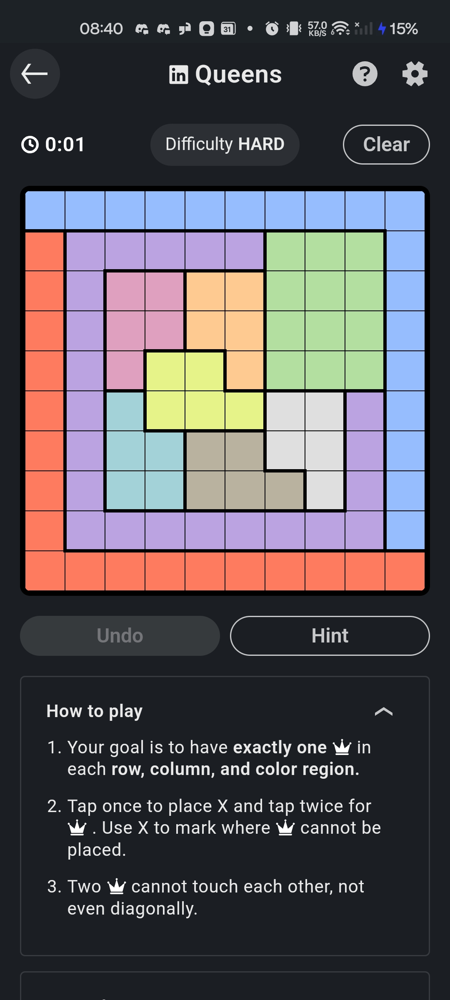
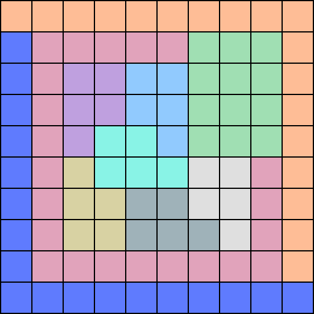
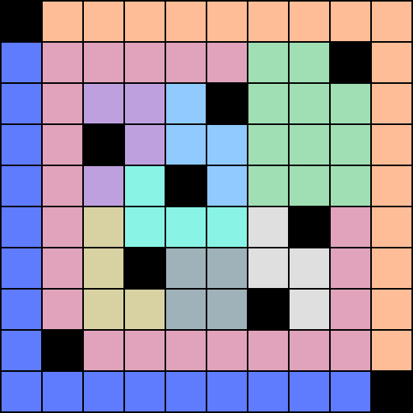

# LinkedIn Queens Solver

1. Screenshot today's game
2. Pass it in to the solver like this
```bash
python solver.py path/to/screenshot
```
3. Get a png file with the solution

## Input


## Output




### How
 - OpenCV to recognise the grid size and colours and conver them to an array
 - Backtracking solver adjusted from original n-Queens problem (this version is easier because colours are an extra contraint reducing the search space)
 - Pillow to create the output image from the array

### Coming to a serverless function near you soon

### Environment setup
```bash
python -m venv venv
source venv/bin/activate
python -m pip install -r requirements.txt
# python -m pip freeze > requirements.txt
# deactivate
```

### Unit tested
```bash
python -m unittest
```
